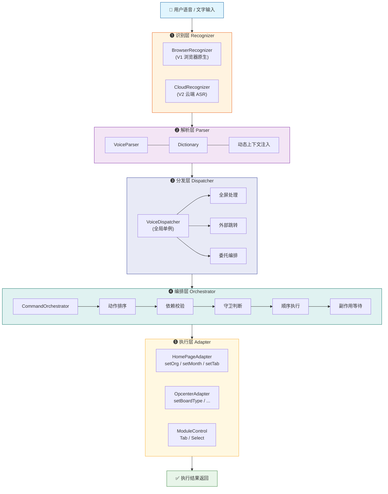

# 集团驾驶舱语音交互系统：从前端架构到工程实践

> 本文详细介绍了集团驾驶舱大屏项目中语音交互系统的技术方案设计，涵盖五层管道式架构、自然语言解析引擎、多页面适配器模式、动作编排执行器等核心模块，以及跨页面命令流转、歧义澄清追问等关键工程问题的解决思路。

---

## 一、项目背景与需求分析

### 1.1 业务场景

集团驾驶舱大屏是面向集团管理层的运营数据可视化看板，包含业绩预警看板、运营驾驶舱、规模看板、对标看板等多个页面。大屏通常部署在会议室或领导办公室，用户需要通过遥控器或鼠标进行页面切换、筛选条件变更等操作，交互效率较低。

### 1.2 核心需求

引入语音交互能力，让用户可以通过自然语言直接控制大屏：

| 交互类型 | 示例指令 | 预期效果 |
|---------|---------|---------|
| 页面跳转 | "切换到运营驾驶舱" | 跳转至整体看板页面 |
| 多维筛选 | "看华南区域公司2月份经营画像" | 切换组织 + 切换月份 + 切换 Tab |
| 看板切换 | "切换到规模看板" | 在驾驶舱内切换看板类型 |
| 模块操作 | "新增签约饱和收入按贡献占比" | 切换图表卡片的对比维度 |
| 全屏控制 | "进入全屏" | 全屏展示 |
| 组合指令 | "切换到驾驶舱，筛选深圳区域公司，查看3月份的与目标比" | 跳转 + 组织 + 月份 + 模块 Tab 一次完成 |

### 1.3 设计约束

- **无 LLM 依赖**：内网环境，不能调用大模型做意图理解，必须用规则引擎解析
- **低延迟要求**：语音指令从说出到页面响应，用户体感不超过 2 秒
- **跨页面联动**：跳转后的筛选条件需要在目标页面自动执行
- **渐进增强**：V1 使用浏览器原生 Web Speech API 快速验证，V2 切换云端 ASR

---

## 二、系统架构总览

### 2.1 五层管道式架构

语音交互系统采用**五层管道式架构**，每一层职责单一、可独立替换：



### 2.1.1 一条指令的完整旅程

以用户说出 **"切换到驾驶舱，筛选深圳区域公司，查看 3 月份的与目标比"** 为例，追踪整条链路：

```mermaid
sequenceDiagram
    actor 用户
    participant UI as 🖥 VoiceCommandPanel
    participant Rec as 🎙 Recognizer
    participant Par as 🧠 Parser
    participant Dis as 📡 Dispatcher
    participant Orc as ⚙ Orchestrator
    participant Reg as 🗃 Registry
    participant Adp as 🔌 Adapter

    用户->>UI: 说出：切换到驾驶舱，查看深圳区域公司<br/>3月份的与目标比
    UI->>Rec: 启动识别

    rect rgb(255, 243, 224)
        Note over Rec: ❶ 识别层
        Rec-->>Rec: PCM 音频流 → 云端 ASR
        Rec-->>UI: "切换到驾驶舱筛选深圳区域公司<br/>查看3月份的与目标比"
    end

    UI->>Par: parse(text)

    rect rgb(243, 229, 245)
        Note over Par: ❷ 解析层
        Par->>Par: Dictionary 匹配关键词<br/>"驾驶舱"→opcenter, "深圳区域公司"→org
        Par->>Par: 正则提取月份、Tab 等实体
        Par-->>UI: VoiceIntent {<br/>  command: {<br/>    targetCode: "opcenter",<br/>    actions: [navigate, setOrg, setMonth, switchModuleTab]<br/>  }<br/>}
    end

    UI->>Dis: dispatch(intent)

    rect rgb(232, 234, 246)
        Note over Dis: ❸ 分发层
        Dis->>Dis: 非全屏/非外部跳转 → 委托编排
        Dis->>Orc: execute(command)
    end

    rect rgb(224, 242, 241)
        Note over Orc: ❹ 编排层
        Orc->>Orc: 1. 排序：navigate 必须在 setOrg 前
        Orc->>Orc: 2. 检查 navigate 是否需要跨页面
        Orc->>Reg: 获取目标页 Adapter
        Orc->>Adp: 3. 逐条执行 action

        rect rgb(255, 248, 225)
            Note over Adp: ❺ 执行层
            Adp-->>Orc: navigate → 路由跳转 → SUCCESS
            Adp-->>Orc: setOrg("深圳区域公司") → SUCCESS
            Orc->>Orc: 4. shouldWaitAfterRun → 等待页面渲染
            Adp-->>Orc: setMonth("3月") → SUCCESS
            Adp-->>Orc: switchModuleTab("与目标比") → SUCCESS
        end

        Orc-->>Dis: { status: SUCCESS, actions: [...] }
    end

    Dis-->>UI: { success: true, message: "操作成功" }
    UI-->>用户: ✅ 大屏展示深圳区域公司 3 月与目标比数据
```

### 2.2 目录结构

```
src/voice/
├── types.ts                     # 核心类型定义
├── types/
│   ├── adapter.ts               # IPageAdapter 接口
│   ├── command.ts               # CommandAction 联合类型
│   ├── execution.ts              # 执行结果类型
│   └── module.ts                 # 模块控件类型
├── core/
│   ├── dictionary.ts             # 同义词 + 正则模式
│   ├── parser.ts                 # 自然语言 → VoiceIntent
│   ├── dispatcher.ts             # 全局分发入口
│   ├── orchestrator.ts           # 动作编排执行器
│   └── wait.ts                   # 异步等待工具
├── registry/
│   ├── pageAdapterRegistry.ts    # 页面适配器注册中心
│   ├── moduleControlRegistry.ts  # 模块控件注册中心
│   ├── executionRules.ts         # 各页面动作执行规则
│   ├── pendingCommandStore.ts    # 跨页面命令暂存
│   └── clarifyContextStore.ts    # 澄清追问上下文
├── adapters/
│   ├── homeAdapter.ts            # 首页适配器
│   └── opcenterAdapter.ts       # 驾驶舱适配器
├── recognizers/
│   ├── browserRecognizer.ts     # 浏览器原生 ASR
│   ├── cloudRecognizer.ts       # 云端 ASR（WebSocket）
│   └── audioRecorder.ts         # 麦克风录音 + PCM 重采样
├── hooks/
│   ├── useVoiceControl.ts       # 语音控制核心 composable
│   └── useVoiceCommand.ts       # 路由级 composable（注入全局能力）
├── components/
│   └── VoiceCommandPanel.vue    # 语音助手 UI 面板
└── TODO_CLOUD_ASR.md            # 云端 ASR 接入清单
```

---

## 三、识别层：语音转文字

### 3.1 IRecognizer 接口抽象

识别层通过 `IRecognizer` 接口进行抽象，屏蔽底层 ASR 引擎差异：

```typescript
// src/voice/types.ts
export interface ASRResult {
    text: string;
    isFinal: boolean;  // 区分中间结果与最终结果
}

export interface IRecognizer {
    start(): Promise<void>;
    stop(): void;
    onResult: (result: ASRResult) => void;
    onError: (error: Error) => void;
    onStatusChange: (status: 'ready' | 'listening' | 'processing' | 'error') => void;
}
```

**设计要点**：
- `isFinal` 区分识别中间结果和最终结果，中间结果用于 UI 实时展示，最终结果触发命令执行
- `onStatusChange` 回调驱动 UI 状态切换（待机/聆听/处理/错误）

### 3.2 BrowserRecognizer（V1 方案）

基于 Web Speech API（`webkitSpeechRecognition`）实现：

```typescript
// src/voice/recognizers/browserRecognizer.ts
export class BrowserRecognizer implements IRecognizer {
    constructor() {
        const SpeechRecognition = window.SpeechRecognition || window.webkitSpeechRecognition;
        this.recognition = new SpeechRecognition();
        this.recognition.continuous = true;       // 持续监听
        this.recognition.interimResults = true;    // 返回中间结果
        this.recognition.lang = 'zh-CN';          // 中文识别
    }
}
```

**优点**：零部署成本，开箱即用
**局限**：仅 Chrome/Edge 支持，识别精度有限，内网环境可能不可用

### 3.3 CloudRecognizer（V2 方案）

通过 WebSocket 连接云端 ASR 服务，使用 `AudioRecorder` 采集麦克风音频：

```
┌──────────┐    PCM 16kHz    ┌──────────┐   WebSocket   ┌──────────┐
│  麦克风    │ ──────────────► │ AudioRecorder │ ─────────────► │ 云端 ASR │
└──────────┘                 └──────────┘                └──────────┘
                                                              │
                                                     JSON { text, isFinal }
                                                              │
                                                              ▼
                                                         onResult 回调
```

**AudioRecorder 核心实现**：

```typescript
// src/voice/recognizers/audioRecorder.ts
export class AudioRecorder {
    private readonly targetSampleRate = 16000; // 云厂商通用要求

    public async start() {
        this.stream = await navigator.mediaDevices.getUserMedia({
            audio: { channelCount: 1, echoCancellation: true, noiseSuppression: true }
        });
        this.audioContext = new AudioContext();
        this.processor = this.audioContext.createScriptProcessor(4096, 1, 1);
        this.processor.onaudioprocess = (e) => {
            const inputData = e.inputBuffer.getChannelData(0);
            // 浏览器 48kHz → 云端 16kHz 线性插值降采样 + Float32 → Int16 PCM
            const pcmData = this.resampleAndConvertToInt16(
                inputData, this.audioContext.sampleRate, this.targetSampleRate
            );
            this.onDataAvailable?.(pcmData);
        };
    }
}
```

**关键技术细节**：
- 浏览器原生采样率通常为 48kHz，云厂商要求 16kHz PCM，需要**线性插值降采样**
- `Float32` 音频数据需转换为 `Int16` PCM 格式：`s < 0 ? s * 0x8000 : s * 0x7FFF`
- 开启浏览器原生回声消除（`echoCancellation`）和降噪（`noiseSuppression`）

### 3.4 方案切换

在 `useVoiceControl.ts` 中，通过注释切换识别器实现：

```typescript
// V1: 浏览器原生 API
recognizer = new BrowserRecognizer();

// V2: 云端 ASR（后端接口就绪后启用）
// const { wsUrl, token } = await getBackendVoiceAuth();
// recognizer = new CloudRecognizer(wsUrl);
```

---

## 四、解析层：自然语言理解引擎

### 4.1 解析流程

`VoiceParser` 是整个系统最复杂的模块，负责将自然语言文本解析为结构化的 `VoiceIntent` + `ParsedCommand`。解析流程按优先级从高到低依次提取：

```
输入: "切换到驾驶舱，看华南区域公司2月份的经营画像"

Step 1: extractFullscreen()  →  null（不包含"全屏"）
Step 2: extractPage()        →  "驾驶舱" → COCKPIT_CODE.JIA_SHI_CANG
Step 3: extractMonth()       →  "2月份" → "2026-02"
Step 4: extractOrg()         →  "华南区域公司" → 匹配动态注入的组织列表
Step 5: extractTab()         →  "经营画像" → 匹配 Tab 别名
Step 6: extractBoardType()   →  null
Step 7: extractModuleActions() →  []

输出: VoiceIntent {
  type: NAVIGATE,
  entities: { targetPage: JIA_SHI_CANG, month: "2026-02", orgName: "华南区域公司", tabName: "经营画像" },
  command: ParsedCommand {
    actions: [navigate, setOrg, setMonth, setPageTab],
    needNavigate: true
  }
}
```

### 4.2 同义词映射（Dictionary）

`dictionary.ts` 维护了两层映射：

```typescript
// 页面别名 → 内部编码
PAGES: {
    '业绩预警': COCKPIT_CODE.YE_JI_YU_JING,
    '运营驾驶舱': COCKPIT_CODE.JIA_SHI_CANG,
    '驾驶舱': COCKPIT_CODE.JIA_SHI_CANG,
    '规模看板': COCKPIT_CODE.GUI_MO_KAN_BAN,
    '对标看板': COCKPIT_CODE.BENCHMARK,
    // ...
}

// Tab 别名 → 标准名称
TAB_ALIASES: {
    '运营画像': '经营画像',
    '画像': '经营画像',
}
```

**扩展性设计**：同义词表可以随时扩展，无需修改解析逻辑。

### 4.3 动态上下文注入

解析器在每次解析前，从当前页面适配器获取实时数据注入：

```typescript
// useVoiceControl.ts
const context = voiceDispatcher.getContextInfo();
parser.setContext(
    context.orgs,             // 当前页面可用组织列表
    context.tabs,             // 当前页面可用 Tab 列表
    context.currentPageId,    // 当前页面 ID
    context.currentBoardType, // 当前看板类型
    context.modules           // 当前页面可操控的模块上下文
);
```

**为什么需要动态注入？**
- 组织列表来自接口，不同用户权限看到的组织不同
- Tab 列表因看板类型而异（整体看板 vs 规模看板的 Tab 不同）
- 模块上下文（图表卡片 ID、控件选项）在运行时动态注册

### 4.4 组织名称提取

组织名称提取是最复杂的部分，因为组织名是动态的且可能包含多种表述：

```typescript
private extractOrg(text: string, targetPageId?: PageId): string | null {
    // 1. 优先完全匹配动态组织列表
    for (const org of this.orgList) {
        if (text.includes(org) || org.includes(text)) return org;
    }

    // 2. 正则提取：匹配 "XXX区域公司" / "XXX区域" / "XXX集团" 等模式
    const matches = text.match(/[\u4e00-\u9fa5A-Za-z]+?(?:区域公司|区域|公司|集团)/g);

    // 3. 清洗：移除已识别的页面名、Tab名、动作词等干扰词
    const sanitizedText = this.sanitizeForOrgExtraction(text);

    // 4. 归一化：去除前缀动作词（"切换到"、"看"等）
    return this.normalizeOrgCandidate(candidate);
}
```

### 4.5 模块操作提取与歧义处理

模块操作（图表卡片的 Tab/Select 切换）是最细粒度的控制能力：

```
用户说: "新增签约饱和收入按贡献占比"
         ┌──────────────┐    ┌──────────────┐
         │  模块匹配       │    │  选项匹配       │
         │  "新增签约饱和收入"│    │  "按贡献占比"   │
         └──────┬───────┘    └──────┬───────┘
                │                    │
                ▼                    ▼
         moduleId: "groupNewContract"  controlId: "compareTab", value: 1
```

**歧义澄清**：当多个模块标题相同时（如整体看板和规模看板都有"新增签约饱和收入"），系统生成 `clarify` 动作：

```typescript
// parser.ts
if (topMatchedModules.length > 1 && this.shouldClarifyMatchedModules(topMatchedModules)) {
    return [{
        type: 'clarify',
        reason: `检测到多个同名模块，请补充：集团新增签约饱和收入 或 下属公司新增签约饱和收入`,
        options: topMatchedModules.map(item => ({
            label: item.module.aliases?.[0] || item.module.title,
            // ...
        })),
    }];
}
```

用户在下一轮对话中回答"集团的"，系统通过 `clarifyContextStore` 自动将追问结果合并到原始指令中重新解析。

### 4.6 no-op 处理

某些模块在特定看板类型下只支持单一选项（如规模看板的"集团当年可转化营收"只有"按贡献占比"），此时生成 `noop` 动作：

```typescript
if (matchedModule.module.executable === false) {
    return [{
        type: 'noop',
        reason: `模块"当年可转化营收"当前仅支持"按贡献占比"，无需切换`,
    }];
}
```

---

## 五、分发层：全局路由与能力注入

### 5.1 VoiceDispatcher 设计

`VoiceDispatcher` 是全局单例，承担三个职责：

1. **全局能力处理**：全屏控制（无需经过编排层）
2. **外部跳转路由**：识别出跳转到外部系统（如物业收费看板）时，直接调用全局导航
3. **委托编排层**：将需要页面适配器执行的命令委托给 `CommandOrchestrator`

```typescript
// src/voice/core/dispatcher.ts
export class VoiceDispatcher {
    // 依赖注入全局方法，避免直接引用 router / pinia 导致强耦合
    public globalNavigate: (targetPage: string) => VoiceActionResult = () => ({...});
    public globalFullscreen: (action) => VoiceActionResult = () => ({...});

    public async dispatch(intent: VoiceIntent): Promise<VoiceActionResult> {
        // 1. 置信度过滤
        if (intent.confidence < 0.5 || intent.type === VoiceIntentType.UNKNOWN) {
            return { success: false, message: '未识别到有效指令' };
        }

        // 2. 全屏（全局能力，需二次确认）
        if (intent.type === VoiceIntentType.FULLSCREEN) {
            if (intent.entities.fullscreenAction === 'enter') {
                return { success: true, requireConfirm: true }; // 浏览器安全策略需用户确认
            }
            return this.globalFullscreen(intent.entities.fullscreenAction);
        }

        // 3. 外部系统跳转
        const externalTargetCode = this.getExternalNavigateTarget(intent);
        if (externalTargetCode) return this.globalNavigate(externalTargetCode);

        // 4. 委托编排层执行
        const result = await this.orchestrator.execute(intent.command);
        return { success: [...].includes(result.status), message: result.userMessage };
    }
}
```

### 5.2 能力注入（useVoiceCommand）

`useVoiceCommand` 是路由级 composable，在 `App.vue` 中调用，为 Dispatcher 注入全局能力：

```typescript
// src/voice/hooks/useVoiceCommand.ts
voiceDispatcher.globalFullscreen = (action) => {
    if (action === 'enter' && !store.fullscreen) {
        toggleFullscreen(false);
        return { success: true, message: '已全屏' };
    }
    // ...
};

voiceDispatcher.globalNavigate = (targetPage) => {
    const hasPermission = functionList.some(item => item.functionCode === targetPage);
    if (!hasPermission) return { success: false, message: '您没有该页面的访问权限' };

    // 外部系统（物业收费看板）走特殊跳转
    if (EXTERNAL_FUNCTION_CODE_SET.has(targetCode)) {
        externalNavigateHandlers[targetCode]();
        return { success: true, message: '已打开目标页面' };
    }

    // 内部页面走 iframe 通信
    navigateToTargetUrl(functionItem.functionPath, targetCode);
    return { success: true, message: '已切换到目标页面' };
};
```

**设计亮点**：Dispatcher 通过依赖注入获取全局能力，而非直接 `import router`，实现了**核心逻辑与框架的解耦**。

---

## 六、编排层：动作排序、依赖与执行

### 6.1 CommandOrchestrator 核心流程

`CommandOrchestrator` 负责将一个 `ParsedCommand`（包含多个动作）按正确顺序执行：

```
ParsedCommand.actions = [setMonth, setOrg, setPageTab, navigate]

                     ┌──────────────────────┐
                     │ 1. 按 executionRules  │
                     │    排序动作顺序        │
                     └──────────┬───────────┘
                                ▼
                     ┌──────────────────────┐
                     │ 2. 检查依赖关系       │
                     │    dependsOn 校验     │
                     └──────────┬───────────┘
                                ▼
                     ┌──────────────────────┐
                     │ 3. 守卫条件 canRun     │
                     │    (如对标看板不支持月份)│
                     └──────────┬───────────┘
                                ▼
                     ┌──────────────────────┐
                     │ 4. 执行动作            │
                     │    adapter.execute()  │
                     └──────────┬───────────┘
                                ▼
                     ┌──────────────────────┐
                     │ 5. 等待副作用完成      │
                     │    shouldWaitAfterRun │
                     └──────────┬───────────┘
                                ▼
                     ┌──────────────────────┐
                     │ 6. 更新上下文 ctx      │
                     │    供后续动作使用       │
                     └──────────────────────┘
```

### 6.2 执行规则（Execution Rules）

每个页面定义了自己的动作执行规则，包括**排序优先级**、**依赖关系**、**守卫条件**和**副作用等待**：

```typescript
// src/voice/registry/executionRules.ts
export const opcenterExecutionRule: PageExecutionRule = {
    pageId: 'opcenter',
    actions: [
        // 阶段1：导航（最高优先级）
        { type: 'navigate', stage: 'navigate', order: 1, shouldWaitAfterRun: true, waitFor: 'pageReady' },

        // 阶段2：上下文设置（看板类型决定后续动作能否执行）
        { type: 'setBoardType', stage: 'context', order: 10, shouldWaitAfterRun: true, waitFor: 'headerReady' },

        // 阶段3：筛选条件
        { type: 'setMonth', stage: 'filter', order: 20, dependsOn: ['setBoardType'],
          canRun: (ctx) => ctx.boardType !== 3, skipReason: '当前看板不支持月份筛选' },
        { type: 'setYearPeriod', stage: 'filter', order: 21, dependsOn: ['setBoardType'],
          canRun: (ctx) => ctx.boardType === 3, skipReason: '当前看板不支持年度周期筛选' },

        // 阶段4：模块操作
        { type: 'setModuleTab', stage: 'module', order: 40, dependsOn: ['setBoardType'] },
        { type: 'setSelect', stage: 'module', order: 50, dependsOn: ['setBoardType'] },
    ],
};
```

**关键设计**：
- `dependsOn`：声明动作间的前置依赖，如 `setMonth` 依赖 `setBoardType` 先完成（因为对标看板不支持月份筛选）
- `canRun`：运行时守卫，根据当前上下文决定动作是否应该执行
- `shouldWaitAfterRun` + `waitFor`：某些动作执行后需要等待页面副作用完成（如切换看板类型后需等待 Header 组件重新渲染）

### 6.3 跨页面命令流转

当指令包含页面跳转时，编排器需要处理"先跳转，再在目标页面执行筛选"的流程：

```
用户说: "切换到驾驶舱，看2月份的数据"

1. orchestrator 检测到 needNavigate = true
2. pendingCommandStore.set(command)   ← 暂存完整命令到 SessionStorage
3. navigate('opcenter')              ← 触发页面跳转
4. pageAdapterRegistry.waitFor('opcenter')  ← 等待目标页面适配器注册
5. adapter.whenReady()               ← 等待目标页面数据就绪
6. pendingCommandStore.clear()       ← 清除暂存
7. 继续执行剩余动作 (setMonth 等)
```

`pendingCommandStore` 采用**内存 + SessionStorage**双写策略，防止页面刷新导致命令丢失。

### 6.4 执行结果汇总

编排器将所有动作结果汇总为用户友好的消息：

```typescript
private summarize(command: ParsedCommand, actionResults: ActionResult[]): CommandExecutionResult {
    const hasExecuted = actionResults.some(item => item.status === ActionStatus.EXECUTED);
    const hasChangedFailure = actionResults.some(item =>
        [ActionStatus.UNMATCHED, ActionStatus.FAILED, ActionStatus.SKIPPED].includes(item.status)
    );
    const hasAmbiguous = actionResults.some(item => item.status === ActionStatus.AMBIGUOUS);
    const allUnchanged = actionResults.every(item => item.status === ActionStatus.UNCHANGED);

    // 5 种终态：SUCCESS / PARTIAL_SUCCESS / FAILED / NEED_CLARIFY / NO_OP
}
```

| 状态 | 含义 | 示例 |
|------|------|------|
| `SUCCESS` | 所有动作执行成功 | "已切换到目标页面，月份已切换为2026-02" |
| `PARTIAL_SUCCESS` | 部分成功部分失败 | "组织已切换为华南区域公司；对标看板不支持月份筛选" |
| `FAILED` | 所有动作失败 | "未识别到有效指令" |
| `NEED_CLARIFY` | 存在歧义需追问 | "检测到多个同名模块，请补充：集团新增签约饱和收入 或 下属公司新增签约饱和收入" |
| `NO_OP` | 当前已符合目标条件 | "当前已符合目标条件，无需调整" |

---

## 七、执行层：页面适配器模式

### 7.1 IPageAdapter 接口

每个页面实现 `IPageAdapter` 接口，封装该页面的语音控制能力：

```typescript
// src/voice/types/adapter.ts
export interface IPageAdapter {
    pageId: PageId;
    isReady(): boolean;
    whenReady(): Promise<void>;
    waitFor(target: WaitTarget): Promise<void>;
    getAvailableOrgs(): string[];
    getAvailablePageTabs(): string[];
    getCurrentContext(): Partial<ExecutionContext>;
    execute(action: CommandAction, ctx: ExecutionContext): Promise<ActionResult>;
}
```

### 7.2 适配器注册与发现

`PageAdapterRegistry` 管理适配器的生命周期，支持**异步等待注册**（跨页面跳转场景）：

```typescript
// 页面组件在 mounted 时注册适配器
const adapter = new HomePageAdapter(controller);
voiceDispatcher.registerAdapter(adapter);

// 页面组件在 unmounted 时注销
voiceDispatcher.unregisterAdapter('home');
```

```typescript
// 编排器等待目标页面适配器就绪
async waitFor(pageId: PageId, timeout = 6000): Promise<IPageAdapter> {
    const existing = this.get(pageId);
    if (existing) return existing;

    // 目标页面尚未挂载，注册等待回调
    return new Promise((resolve, reject) => {
        const timer = setTimeout(() => reject(new Error('timeout')), timeout);
        const waiters = this.waiters.get(pageId) || [];
        waiters.push((adapter) => { clearTimeout(timer); resolve(adapter); });
        this.waiters.set(pageId, waiters);
    });
}
```

### 7.3 HomePageAdapter 实现示例

```typescript
// src/voice/adapters/homeAdapter.ts
export class HomePageAdapter implements IPageAdapter {
    pageId = 'home' as const;
    constructor(private readonly controller: HomePageController) {}

    async execute(action: CommandAction, _ctx: ExecutionContext): Promise<ActionResult> {
        switch (action.type) {
            case 'setOrg': {
                // 幂等性检查：如果已经是目标组织，返回 UNCHANGED
                if (this.controller.getCurrentState().orgName === action.value) {
                    return { type: action.type, status: ActionStatus.UNCHANGED, reason: '组织未变化' };
                }
                return this.controller.setOrgByName(action.value)
                    ? { type: action.type, status: ActionStatus.EXECUTED, changed: true }
                    : { type: action.type, status: ActionStatus.UNMATCHED, reason: `未找到组织"${action.value}"` };
            }
            case 'setMonth': { /* ... */ }
            case 'setPageTab': { /* ... */ }
            default:
                return { type: action.type, status: ActionStatus.SKIPPED, reason: 'home 页面暂不支持该动作' };
        }
    }
}
```

**设计要点**：
- **Controller 注入**：适配器不直接操作 Pinia Store 或调用 API，而是通过 `Controller` 接口委托给页面组件实现
- **幂等性**：每个动作执行前检查当前状态，避免不必要的 UI 更新
- **动作隔离**：不支持的动作类型返回 `SKIPPED`，不影响其他动作的执行

### 7.4 模块控件注册

图表卡片内的 Tab/Select 切换通过 `ModuleControlRegistry` 单独管理，因为模块是动态挂载的：

```typescript
// 图表卡片组件在 setup 时注册
moduleControlRegistry.register({
    pageId: 'opcenter',
    boardType: 1,
    moduleId: 'groupNewContract',
    title: '新增签约饱和收入',
    aliases: ['集团新增签约饱和收入'],
    controls: [{
        controlId: 'compareTab',
        controlType: 'tab',
        label: '对比维度',
        options: [
            { label: '按贡献占比', value: 1 },
            { label: '与目标比', value: 2 },
        ],
        // 运行时绑定：获取和设置当前值
        getValue: () => currentCompareTab.value,
        setValue: (val) => { currentCompareTab.value = val; return true; },
    }],
});
```

---

## 八、关键工程问题与解决方案

### 8.1 跨页面命令流转

**问题**：用户说"切换到驾驶舱看2月数据"，需要先跳转页面，再在目标页面执行月份筛选。但页面跳转后，当前页面的适配器已销毁，新页面适配器尚未就绪。

**方案**：`pendingCommandStore` + `pageAdapterRegistry.waitFor()`

```
1. pendingCommandStore.set(command)  ← 命令暂存到 SessionStorage
2. navigate(targetPageId)            ← 触发路由跳转
3. pageAdapterRegistry.waitFor()     ← 等待新页面适配器注册（Promise 挂起）
4. [新页面 mounted] → 适配器注册 → Promise resolve
5. adapter.whenReady()               ← 等待新页面数据加载完成
6. pendingCommandStore.clear()       ← 清除暂存
7. 继续执行剩余动作
```

### 8.2 歧义澄清追问

**问题**：整体看板和规模看板都有"新增签约饱和收入"模块，用户说"新增签约饱和收入按贡献占比"时无法确定操作哪个。

**方案**：`clarifyContextStore` 两轮对话机制

```
Round 1: "新增签约饱和收入按贡献占比"
         → 解析出 clarify 动作
         → UI 显示: "检测到多个同名模块，请补充：集团新增签约饱和收入 或 下属公司新增签约饱和收入"
         → clarifyContextStore.set({ rawText, options })

Round 2: "集团的"
         → clarifyContextStore.tryResolveFollowUp("集团的")
         → 匹配到 options[0].aliases 包含"集团的"
         → 生成: "集团新增签约饱和收入按贡献占比"
         → 重新进入 VoiceParser.parse()
```

**追问识别**：通过正则判断用户输入是否是追问（短文本、不含指令关键词）：

```typescript
private isFollowUpText(text: string) {
    if (text.length > 16) return false;
    return !/(切到|切换|我要看|我想看|进入|打开|看板|月份|月|年度|\d)/.test(text);
}
```

### 8.3 全屏安全策略

**问题**：浏览器安全策略要求全屏操作必须由用户主动触发，语音指令属于程序化触发。

**方案**：二次确认机制

```typescript
// Dispatcher 返回 requireConfirm: true
if (intent.entities.fullscreenAction === 'enter') {
    return { success: true, message: '即将进入全屏', requireConfirm: true };
}

// UI 展示确认按钮
<div v-if="actionResult.requireConfirm" class="confirm-actions">
    <button @click="confirmAction">确认执行</button>
    <button @click="cancelAction">取消</button>
</div>
```

### 8.4 异步等待机制

**问题**：动作执行后，页面组件可能需要时间重新渲染（如切换看板类型后 Header 需要重新加载数据）。

**方案**：`waitUntil` 轮询 + `shouldWaitAfterRun` 声明

```typescript
// 通用异步等待工具
export async function waitUntil(predicate: () => boolean, timeout = 3000, interval = 50) {
    if (predicate()) return;
    return new Promise((resolve, reject) => {
        const timer = setInterval(() => {
            if (predicate()) { clearInterval(timer); resolve(); return; }
            if (Date.now() - start >= timeout) { clearInterval(timer); reject(new Error('timeout')); }
        }, interval);
    });
}

// 执行规则中声明等待
{ type: 'setBoardType', shouldWaitAfterRun: true, waitFor: 'headerReady' }

// 编排器中执行等待
if (result.status === ActionStatus.EXECUTED && actionRule?.shouldWaitAfterRun) {
    await adapter.waitFor(actionRule.waitFor);
    Object.assign(ctx, adapter.getCurrentContext()); // 刷新上下文
}
```

---

## 九、数据流全景图

```
┌─────────────────────────────────────────────────────────────────────┐
│                           VoiceCommandPanel.vue                      │
│  ┌────────────┐  ┌──────────────┐  ┌──────────────────────────────┐ │
│  │ 麦克风按钮   │  │ 文本输入框    │  │ 结果展示 + 二次确认            │ │
│  └─────┬──────┘  └──────┬───────┘  └──────────────────────────────┘ │
└────────┼────────────────┼──────────────────────────────────────────┘
         │                │
         ▼                ▼
┌─────────────────────────────────────────────────────────────────────┐
│                      useVoiceControl (Composable)                    │
│                                                                      │
│  1. Recognizer.start() ──► ASR 识别 ──► onResult({ text, isFinal }) │
│                          或                                          │
│  1. submitTextCommand(text) ──► 直接获得文本                          │
│                                                                      │
│  2. clarifyContextStore.tryResolveFollowUp(text) ──► 澄清追问合并     │
│                                                                      │
│  3. parser.setContext(orgs, tabs, pageId, boardType, modules)        │
│                                                                      │
│  4. parser.parse(text) ──► VoiceIntent { type, entities, command } │
│                                                                      │
│  5. voiceDispatcher.dispatch(intent) ──► VoiceActionResult           │
│                                                                      │
│  6. 更新 actionResult → UI 展示执行结果                                │
└─────────────────────────────────────────────────────────────────────┘
         │
         ▼
┌─────────────────────────────────────────────────────────────────────┐
│                      VoiceDispatcher (全局单例)                       │
│                                                                      │
│  ┌─── 全屏 ──────► globalFullscreen() ──► toggleFullscreen()         │
│  │                                                                   │
│  ├─── 外部跳转 ──► globalNavigate() ──► navigateToTargetUrl()        │
│  │                                                                   │
│  └─── 页面命令 ──► orchestrator.execute(command)                     │
└─────────────────────────────────────────────────────────────────────┘
         │
         ▼
┌─────────────────────────────────────────────────────────────────────┐
│                    CommandOrchestrator (动作编排器)                    │
│                                                                      │
│  1. sortActions()          ── 按 executionRules 排序                 │
│  2. 检查 dependsOn          ── 依赖未完成则 SKIP                     │
│  3. 检查 canRun             ── 守卫条件不满足则 SKIP                  │
│  4. adapter.execute(action) ── 委托页面适配器执行                     │
│  5. waitFor(waitTarget)     ── 等待页面副作用完成                     │
│  6. updateContext()         ── 刷新上下文供后续动作使用                 │
│  7. summarize()             ── 汇总所有动作结果                       │
└─────────────────────────────────────────────────────────────────────┘
         │
         ▼
┌─────────────────────────────────────────────────────────────────────┐
│                      IPageAdapter (页面适配器)                        │
│                                                                      │
│  HomePageAdapter                 OpcenterPageAdapter                 │
│  ├── setOrgByName()              ├── setBoardType()                  │
│  ├── setMonth()                  ├── setMonth()                     │
│  ├── setTabByName()              ├── setYearPeriod()                │
│  └── (不支持 setBoardType)        └── moduleControlRegistry.execute()│
│                                          │                            │
│                                          ▼                            │
│                                   ModuleControlRegistry              │
│                                   ├── getValue() / setValue()        │
│                                   └── 实际操作 Vue ref 状态            │
└─────────────────────────────────────────────────────────────────────┘
```

---

## 十、类型系统设计

语音交互系统的类型设计遵循**联合类型（Discriminated Union）**模式，通过 `type` 字段进行类型收窄：

```typescript
// CommandAction 是一个联合类型，每种动作有独立的字段
export type CommandAction =
    | { type: 'noop'; reason: string; rawValue?: string; }
    | { type: 'clarify'; reason: string; candidates?: string[]; options?: ClarifyOption[]; rawValue?: string; }
    | { type: 'navigate'; pageId: PageId; targetCode: COCKPIT_CODE; rawValue?: string; }
    | { type: 'setBoardType'; value: number; rawValue?: string; }
    | { type: 'setOrg'; value: string; rawValue?: string; }
    | { type: 'setMonth'; value: string; rawValue?: string; }
    | { type: 'setYearPeriod'; value: string; rawValue?: string; }
    | { type: 'setPageTab'; value: string; rawValue?: string; }
    | { type: 'setModuleTab'; moduleId: string; controlId: string; value: string | number; rawValue?: string; }
    | { type: 'setSelect'; moduleId: string; controlId: string; value: string | number; rawValue?: string; };
```

**好处**：
- TypeScript 编译器能在 `switch (action.type)` 分支中自动收窄类型
- 每种动作只能访问该类型特有的字段，防止误用
- 新增动作类型只需添加联合成员，不影响已有代码

---

## 十一、云端 ASR 接入路线图

### V1（当前）：BrowserRecognizer

- 适用场景：开发调试、Chrome/Edge 环境
- 优点：零部署成本
- 限制：浏览器兼容性、识别精度有限

### V2（规划中）：CloudRecognizer

接入步骤：

1. **技术选型**：阿里云 / 科大讯飞 / 腾讯云（推荐阿里云或讯飞）
2. **后端鉴权**：提供 Token 接口，前端直连云端（方案 A）；或后端做 WebSocket 代理转发（方案 B，适合严格内网）
3. **前端替换**：`useVoiceControl.ts` 中将 `BrowserRecognizer` 替换为 `CloudRecognizer`
4. **协议适配**：`cloudRecognizer.ts` 中适配云厂商的数据格式
5. **同义词扩充**：收集真实用户发音习惯，持续补充 `dictionary.ts`
6. **噪音测试**：在真实会议室环境测试收音效果
7. **埋点补充**：上报用户语音指令和执行结果，持续优化

---

## 十二、总结与反思

### 架构亮点

| 设计决策 | 收益 |
|---------|------|
| 五层管道式架构 | 每层职责单一、可独立替换（如 ASR 引擎切换不影响解析逻辑） |
| IRecognizer 接口抽象 | ASR 引擎切换只需改一行代码 |
| 适配器模式 + 注册中心 | 新页面接入语音控制只需实现 `IPageAdapter` 接口 |
| CommandAction 联合类型 | 类型安全，编译器自动收窄，防止字段误用 |
| 依赖注入全局能力 | Dispatcher 不直接依赖 Router/Pinia，核心逻辑与框架解耦 |
| 执行规则声明式配置 | 动作排序、依赖、守卫、等待通过配置表达，而非硬编码 |
| 歧义澄清追问 | 解决同名模块等真实业务场景的歧义问题 |
| pendingCommandStore | 优雅解决跨页面跳转后命令继续执行的问题 |

### 可优化方向

1. **TTS 反馈**：增加语音播报执行结果，形成完整的语音交互闭环
2. **多轮对话**：当前仅支持一轮澄清追问，可扩展为多轮交互
3. **模糊匹配**：组织名称当前使用精确匹配，可引入编辑距离或拼音匹配提升容错
4. **意图学习**：基于埋点数据，自动发现高频指令模式，优化解析规则
5. **ScriptProcessorNode 替换**：当前 `AudioRecorder` 使用已废弃的 `ScriptProcessorNode`，应迁移至 `AudioWorklet`
