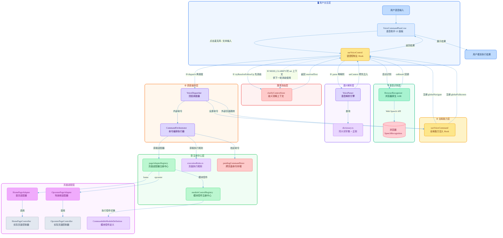
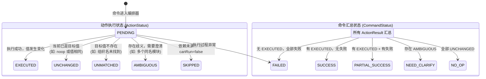
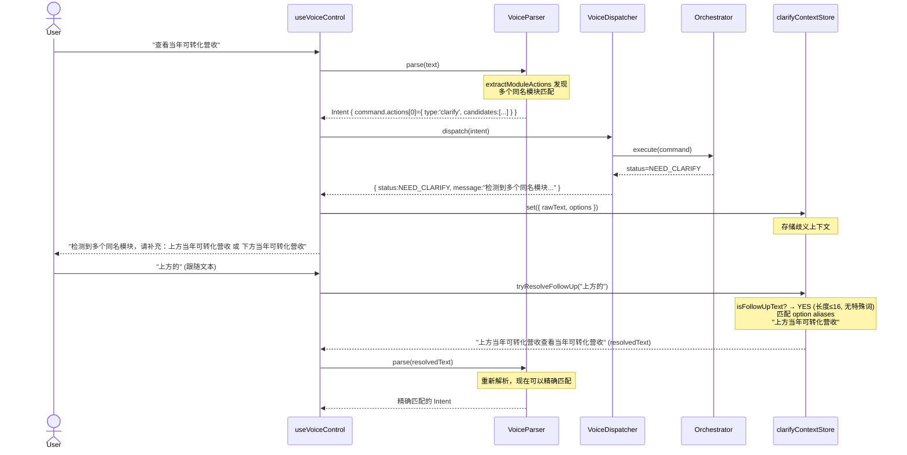
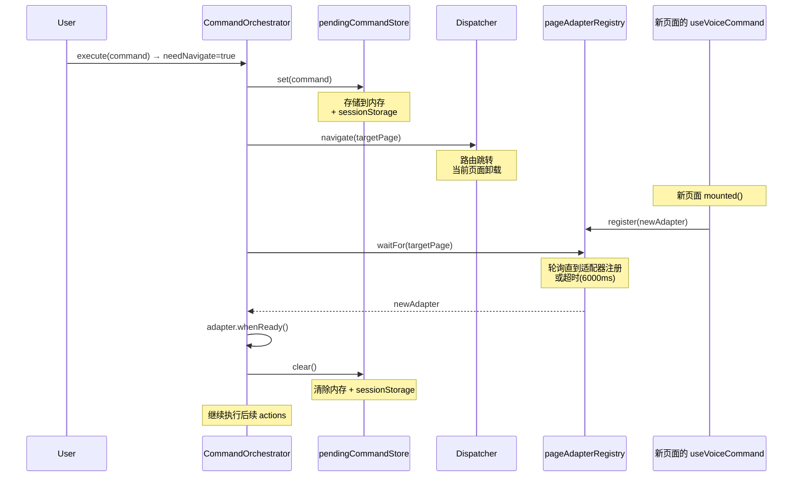

# 语音交互完整工作流程

## 一、架构总览图



---

## 二、完整时序图（Sequence Diagram）

```mermaid
sequenceDiagram
    actor User as 👤 用户
    participant Panel as VoiceCommandPanel<br/>语音面板
    participant Hook as useVoiceControl<br/>控制Hook
    participant Recognizer as BrowserRecognizer<br/>浏览器ASR
    participant Clarify as clarifyContextStore<br/>歧义消解
    participant Parser as VoiceParser<br/>解析引擎
    participant Dispatcher as VoiceDispatcher<br/>调度器
    participant Orchestrator as CommandOrchestrator<br/>编排器
    participant Registry as pageAdapterRegistry<br/>适配器注册
    participant Adapter as PageAdapter<br/>页面适配器
    participant ModuleReg as moduleControlRegistry<br/>模块注册

    rect rgb(240, 248, 255)
        Note over User,ModuleReg: === 阶段0：系统初始化 ===
        Panel->>Hook: onMounted → initRecognizer()
        Hook->>Recognizer: new BrowserRecognizer()
        Recognizer-->>Hook: 绑定 onResult / onError / onStatusChange 回调
        Hook->>Dispatcher: voiceDispatcher.getContextInfo()
        Dispatcher->>Registry: getCurrent() → 获取当前适配器
        Registry-->>Dispatcher: IPageAdapter
        Dispatcher->>Registry: getAvailableOrgs() / getAvailablePageTabs()
        Dispatcher->>ModuleReg: getContexts(pageId, boardType)
        ModuleReg-->>Dispatcher: ModuleContext[]
        Dispatcher-->>Hook: { orgs, tabs, currentPageId, currentBoardType, modules }
        Hook->>Parser: setContext(orgs, tabs, pageId, boardType, modules)
        Note over Parser: 注入动态上下文<br/>供后续实体提取使用
    end

    rect rgb(255, 250, 240)
        Note over User,ModuleReg: === 阶段1：用户触发语音输入 ===
        User->>Panel: 点击麦克风按钮
        Panel->>Hook: toggleListening()
        Hook->>Hook: isDialogVisible = true
        Hook->>Recognizer: start()
        Recognizer->>Recognizer: SpeechRecognition.start()
        Note over Recognizer: 配置: continuous=true<br/>interimResults=true<br/>lang='zh-CN'
        Recognizer-->>Hook: onStatusChange('listening')
        Hook->>Hook: status='listening', isListening=true
        Hook-->>Panel: 更新UI → 显示"正在聆听..."
    end

    rect rgb(240, 255, 240)
        Note over User,ModuleReg: === 阶段2：语音识别（流式） ===
        User->>Recognizer: 🎤 "打开驾驶舱整体看板，查看当年可转化营收"
        Recognizer->>Recognizer: onresult 事件触发
        Note over Recognizer: 中间结果 isFinal=false
        Recognizer-->>Hook: onResult({ text:"打开驾驶舱", isFinal:false })
        Hook->>Hook: recognizedText = "打开驾驶舱"
        Hook-->>Panel: 更新UI → 显示部分识别文本
        Recognizer->>Recognizer: 继续接收语音...
        Recognizer-->>Hook: onResult({ text:"打开驾驶舱整体看板，查看当年可转化营收", isFinal:true })
        Hook->>Hook: recognizedText = 最终文本
        Note over Hook: isFinal=true → 触发 processCommand()
    end

    rect rgb(255, 240, 255)
        Note over User,ModuleReg: === 阶段3：文本预处理 & 澄清消解 ===
        Hook->>Hook: status='processing'
        Hook->>Clarify: tryResolveFollowUp(text)
        Note over Clarify: 检查是否存在待澄清上下文<br/>无 → 返回 null
        Clarify-->>Hook: null (原始文本)
    end

    rect rgb(255, 255, 240)
        Note over User,ModuleReg: === 阶段4：语义解析（VoiceParser.parse） ===
        Hook->>Parser: parse("打开驾驶舱整体看板，查看当年可转化营收")
        
        Note over Parser: 步骤4.1：全屏命令检测（最高优先级）
        Parser->>Parser: extractFullscreen(text)
        Note over Parser: 匹配 SYNONYMS.FULLSCREEN<br/>无匹配 → null
        
        Note over Parser: 步骤4.2：页面跳转检测
        Parser->>Parser: extractPage(text)
        Note over Parser: 匹配 SYNONYMS.PAGES<br/>"驾驶舱" → COCKPIT_CODE.JIA_SHI_CANG
        Parser->>Parser: getPageIdByCode(JIA_SHI_CANG)
        Note over Parser: → 'opcenter'
        Note over Parser: intentType = NAVIGATE, confidence=0.8
        
        Note over Parser: 步骤4.3：筛选条件提取
        Parser->>Parser: extractMonth(text)
        Note over Parser: 正则匹配 PATTERNS.MONTH<br/>无月份信息 → null
        Parser->>Parser: extractYearPeriod(text)
        Note over Parser: 无年度周期 → null
        Parser->>Parser: extractOrg(text, 'opcenter')
        Note over Parser: opcenter 页面无组织筛选 → null
        Parser->>Parser: extractTab(text, 'opcenter')
        Note over Parser: 无 Tab 匹配 → null
        
        Note over Parser: 步骤4.4：看板类型检测
        Parser->>Parser: extractBoardType(text)
        Note over Parser: "整体看板" → boardType=1
        
        Note over Parser: 步骤4.5：模块控件匹配
        Parser->>Parser: extractModuleActions(text, 'opcenter', 1)
        Note over Parser: 从 MODULE_FALLBACKS + runtime modules 中匹配<br/>"当年可转化营收" → groupConvertible module<br/>- executable=false → noop action
        
        Note over Parser: 步骤4.6：构建命令
        Parser->>Parser: buildCommand(rawText, entities, confidence, moduleActions)
        Note over Parser: 生成 actions:<br/>1. navigate to 'opcenter'<br/>2. setBoardType=1<br/>3. noop (不可执行模块)
        Parser-->>Hook: VoiceIntent { type:NAVIGATE, command, confidence:0.8 }
    end

    rect rgb(255, 235, 235)
        Note over User,ModuleReg: === 阶段5：意图调度（VoiceDispatcher.dispatch） ===
        Hook->>Dispatcher: dispatch(intent)
        
        Note over Dispatcher: 步骤5.1：置信度检查
        Dispatcher->>Dispatcher: confidence >= 0.5? → YES
        Dispatcher->>Dispatcher: type !== UNKNOWN? → YES
        
        Note over Dispatcher: 步骤5.2：全屏命令检查
        Dispatcher->>Dispatcher: type === FULLSCREEN? → NO
        
        Note over Dispatcher: 步骤5.3：命令存在性检查
        Dispatcher->>Dispatcher: intent.command 存在? → YES
        
        Note over Dispatcher: 步骤5.4：外部页面跳转检查
        Dispatcher->>Dispatcher: getExternalNavigateTarget(intent)
        Note over Dispatcher: targetCode 不在 EXTERNAL_FUNCTION_CODE_SET → null
        
        Note over Dispatcher: 步骤5.5：委托编排器执行
        Dispatcher->>Orchestrator: execute(command)
    end

    rect rgb(235, 255, 235)
        Note over User,ModuleReg: === 阶段6：命令编排执行（CommandOrchestrator.execute） ===
        
        Note over Orchestrator: 步骤6.1：前置检查
        Orchestrator->>Orchestrator: actions.length > 0? → YES (3个)
        Orchestrator->>Orchestrator: targetPageId = 'opcenter'
        
        Note over Orchestrator: 步骤6.2：获取执行规则并排序
        Orchestrator->>Orchestrator: rule = pageExecutionRuleMap['opcenter']
        Note over Orchestrator: opcenter 规则:<br/>navigate(1) → setBoardType(10) →<br/>setMonth(20) → setYearPeriod(21) →<br/>setPageTab(30) → setModuleTab(40) →<br/>setSelect(50)
        Orchestrator->>Orchestrator: sortActions(actions, 'opcenter')
        Note over Orchestrator: 排序后: navigate, setBoardType, noop
        
        Note over Orchestrator: 步骤6.3：处理页面跳转
        Orchestrator->>Orchestrator: needNavigate=true (currentPageId≠targetPageId)
        Orchestrator->>Orchestrator: pendingCommandStore.set(command)
        Note over Orchestrator: 存储到内存 + sessionStorage
        
        Orchestrator->>Dispatcher: navigate('opcenter', JIA_SHI_CANG)
        Dispatcher->>Dispatcher: globalNavigate('opcenter')
        Note over Dispatcher: useVoiceCommand 中实现<br/>检查权限 → navigateToTargetUrl()
        Dispatcher-->>Orchestrator: { success:true, message:'已切换到目标页面' }
        
        Orchestrator->>Registry: waitFor('opcenter', timeout=6000)
        Note over Registry: 轮询等待新页面适配器注册<br/>新页面 mounted 时调用 register()
        Registry-->>Orchestrator: OpcenterPageAdapter
        
        Orchestrator->>Adapter: whenReady()
        Adapter->>Adapter: waitFor('pageReady')
        Note over Adapter: waitUntil(isReady, 4000ms)<br/>50ms 轮询间隔
        Adapter-->>Orchestrator: ready
        
        Orchestrator->>Orchestrator: pendingCommandStore.clear()
        Orchestrator->>Adapter: getCurrentContext()
        Adapter-->>Orchestrator: { boardType, statDate, ... }
        
        Note over Orchestrator: 步骤6.4：逐动作执行
        
        Note over Orchestrator: --- 动作1: navigate ---
        Orchestrator->>Orchestrator: action.type='navigate'
        Note over Orchestrator: needNavigate=true → status=EXECUTED
        Orchestrator->>Orchestrator: completedTypes.add('navigate')
        
        Note over Orchestrator: --- 动作2: setBoardType ---
        Orchestrator->>Orchestrator: 检查依赖 dependsOn=[] → 无依赖
        Orchestrator->>Orchestrator: canRun(ctx)? → YES
        Orchestrator->>Adapter: execute(action, ctx)
        Adapter->>Adapter: controller.setBoardType(1)
        Adapter-->>Orchestrator: { status:EXECUTED, changed:true }
        Orchestrator->>Orchestrator: completedTypes.add('setBoardType')
        Orchestrator->>Orchestrator: shouldWaitAfterRun → waitFor('headerReady')
        Adapter->>Adapter: waitUntil(isHeaderReady, 4000ms)
        Orchestrator->>Adapter: getCurrentContext() → 更新 ctx
        
        Note over Orchestrator: --- 动作3: noop ---
        Orchestrator->>Orchestrator: action.type='noop'
        Note over Orchestrator: 直接记录 UNCHANGED，跳过执行
    end

    rect rgb(235, 235, 255)
        Note over User,ModuleReg: === 阶段7：结果汇总 ===
        Orchestrator->>Orchestrator: summarize(command, actionResults)
        Note over Orchestrator: 分析所有 ActionResult<br/>有 EXECUTED → SUCCESS
        Orchestrator-->>Dispatcher: CommandExecutionResult {<br/>  status: SUCCESS,<br/>  userMessage: "已切换到目标页面；看板类型已切换为1"
        }
        
        Dispatcher->>Dispatcher: success = [SUCCESS, PARTIAL_SUCCESS, NO_OP].includes(status)
        Dispatcher-->>Hook: VoiceActionResult { success:true, message, status, actions }
    end

    rect rgb(240, 248, 255)
        Note over User,ModuleReg: === 阶段8：结果反馈 & 收尾 ===
        Hook->>Hook: actionResult = result
        
        Note over Hook: 检查是否需要澄清
        Hook->>Hook: status === NEED_CLARIFY? → NO
        Hook->>Clarify: clear()
        
        Hook->>Hook: setTimeout 3秒后清除 actionResult
        Hook->>Hook: status = 'ready', isListening = false
        Hook->>Recognizer: stop()
        Recognizer->>Recognizer: SpeechRecognition.stop()
        
        Hook-->>Panel: 更新UI
        Panel-->>User: 👀 显示 "已切换到目标页面；看板类型已切换为1"
    end
```

---

## 三、状态机图

```mermaid
stateDiagram-v2
    [*] --> Idle: 组件挂载 / 初始化识别器
    
    state Idle {
        [*] --> Ready
        Ready: status='ready'<br/>等待用户操作
    }

    Ready --> Listening: 用户点击麦克风 / start()
    Ready --> Processing: 用户文本输入 / submitTextCommand()

    state Listening {
        [*] --> Recognizing
        Recognizing: Web Speech API 运行中<br/>interimResults=true
        Recognizing --> FinalResult: isFinal=true
    }

    Listening --> Processing: 获取最终识别文本

    state Processing {
        [*] --> ResolvingContext
        ResolvingContext: 检查 clarifyContextStore<br/>是否存在待澄清上下文
        ResolvingContext --> ParsingIntent: 注入上下文 → VoiceParser.setContext()
        
        ParsingIntent: VoiceParser.parse(text)<br/>1. extractFullscreen()<br/>2. extractPage()<br/>3. extractMonth/Org/Tab/BoardType<br/>4. extractModuleActions()<br/>5. buildCommand()
        
        ParsingIntent --> Dispatching: 生成 VoiceIntent
        
        Dispatching: VoiceDispatcher.dispatch(intent)
        
        state Dispatching {
            [*] --> CheckConfidence
            CheckConfidence: confidence >= 0.5 && type != UNKNOWN?
            CheckConfidence --> HandleFullscreen: type=FULLSCREEN?
            CheckConfidence --> CheckExternal: 非全屏命令
            CheckConfidence --> Unknown: 低置信度/未知 → 返回错误
            
            HandleFullscreen: 全屏 enter → requireConfirm<br/>全屏 exit/toggle → 直接执行
            
            CheckExternal: 是否外部页面跳转?
            CheckExternal --> ExternalNav: YES → globalNavigate()
            CheckExternal --> Orchestrate: NO → orchestrator.execute()
            
            ExternalNav --> [*]
            
            Orchestrate: CommandOrchestrator.execute(command)
            state Orchestrate {
                [*] --> SortActions
                SortActions: 按 executionRules 排序
                SortActions --> NeedNavigate
                NeedNavigate: needNavigate?<br/>YES → pendingCommandStore.set()<br/>→ navigate() → waitForAdapter()<br/>→ adapter.whenReady()
                NeedNavigate --> ExecuteActions
                ExecuteActions: 逐动作执行:
                ExecuteActions --> CheckDeps
                CheckDeps: 检查依赖是否满足?<br/>检查 canRun(ctx)?
                CheckDeps --> RunAction
                RunAction: adapter.execute(action, ctx)
                RunAction --> UpdateCtx
                UpdateCtx: 更新 ExecutionContext<br/>如需等待 → waitFor()
                UpdateCtx --> MoreActions
                MoreActions: 还有动作? → ExecuteActions
                MoreActions --> Summarize: 全部完成
            }
            
            Orchestrate --> SummarizeResult
            SummarizeResult: 汇总所有 ActionResult<br/>→ CommandStatus
        }
        
        Dispatching --> HandleResult
        
        HandleResult: 检查 NEED_CLARIFY?<br/>YES → clarifyContextStore.set()<br/>NO → clarifyContextStore.clear()
        
        HandleResult --> [*]
    }

    Processing --> Done: 执行完成
    Done: 3秒后清除结果<br/>status='ready'
    
    Done --> Ready: 等待下一次输入

    Listening --> Error: ASR 错误
    Processing --> Error: 执行异常
    Error: status='error'<br/>显示错误信息
    Error --> Ready: 3秒后恢复

    Ready --> [*]: 组件卸载 / onUnmounted()
```

---

## 四、命令执行状态转换图



---

## 五、核心数据流图

```mermaid
graph LR
    subgraph 输入
        A[原始语音/文本]
    end

    subgraph 识别
        B[ASRResult<br/>text: string<br/>isFinal: boolean]
    end

    subgraph 解析
        C[VoiceEntity<br/>targetPage / orgName<br/>month / yearPeriod<br/>tabName / boardType<br/>fullscreenAction]
        D[VoiceIntent<br/>type: VoiceIntentType<br/>entities: VoiceEntity<br/>rawText: string<br/>confidence: number<br/>command?: ParsedCommand]
        E[ParsedCommand<br/>rawText: string<br/>currentPageId / targetPageId<br/>targetCode<br/>needNavigate: boolean<br/>actions: CommandAction[]]
    end

    subgraph 调度
        F[VoiceActionResult<br/>success: boolean<br/>message: string<br/>requireConfirm?<br/>status?: CommandStatus<br/>actions?: ActionResult[]]
    end

    subgraph 编排
        G[CommandExecutionResult<br/>status: CommandStatus<br/>actions: ActionResult[]<br/>userMessage: string]
    end

    A --> B
    B -->|VoiceParser.parse| C
    C --> D
    D -->|buildCommand| E
    E -->|VoiceDispatcher.dispatch| F
    E -->|CommandOrchestrator.execute| G
    G --> F
    F -->|UI展示| H[用户看到结果]
```

---

## 六、关键模块职责清单

| 模块 | 文件 | 职责 |
|------|------|------|
| **语音面板UI** | `components/VoiceCommandPanel.vue` | 浮动按钮 + 对话卡片，麦克风交互、文本输入、结果显示 |
| **控制Hook** | `hooks/useVoiceControl.ts` | 管理识别器生命周期、串联识别→解析→执行流程、状态管理 |
| **全局能力Hook** | `hooks/useVoiceCommand.ts` | 注入路由跳转、全屏控制等全局能力到 Dispatcher |
| **浏览器ASR** | `recognizers/browserRecognizer.ts` | 封装 Web Speech API，提供流式语音识别 |
| **云端ASR** | `recognizers/cloudRecognizer.ts` | WebSocket + PCM 编码的云端流式识别（待启用） |
| **录音器** | `recognizers/audioRecorder.ts` | 麦克风录音 + PCM 编码（供云端 ASR 使用） |
| **解析引擎** | `core/parser.ts` | 自然语言→结构化命令，实体提取 + 意图分类 + 命令构建 |
| **同义字典** | `core/dictionary.ts` | 页面/全屏/Tab 别名映射 + 正则匹配模式 |
| **调度器** | `core/dispatcher.ts` | 全局单例，意图分发：全屏→全局方法，其他→编排器 |
| **编排器** | `core/orchestrator.ts` | 命令编排核心：排序→导航→等待→逐动作执行→汇总 |
| **等待工具** | `core/wait.ts` | 通用轮询 waitUntil 实现 |
| **适配器注册** | `registry/pageAdapterRegistry.ts` | 管理页面适配器生命周期，支持 waitFor 异步获取 |
| **模块控件注册** | `registry/moduleControlRegistry.ts` | 管理可语音操控的模块控件，执行 tab/select 切换 |
| **执行规则** | `registry/executionRules.ts` | 定义每个页面的动作排序、依赖关系、前置条件 |
| **澄清存储** | `registry/clarifyContextStore.ts` | 存储歧义上下文，支持后续对话消歧（跟随文本匹配） |
| **挂起命令存储** | `registry/pendingCommandStore.ts` | 跨页面跳转时暂存命令（内存 + sessionStorage） |
| **首页适配器** | `adapters/homeAdapter.ts` | 封装首页（业绩预警）的 setOrg/setMonth/setPageTab 操作 |
| **驾驶舱适配器** | `adapters/opcenterAdapter.ts` | 封装驾驶舱的 setBoardType/setMonth/setYearPeriod + 模块控件操作 |

---

## 七、完整执行路径（以"打开驾驶舱整体看板，查看当年可转化营收"为例）

```
用户语音: "打开驾驶舱整体看板，查看当年可转化营收"
    │
    ▼
[1] BrowserRecognizer
    └─ Web Speech API 识别 → ASRResult { text:"打开驾驶舱整体看板...", isFinal:true }
    │
    ▼
[2] useVoiceControl.processCommand()
    ├─ clarifyContextStore.tryResolveFollowUp() → null (无待澄清上下文)
    ├─ voiceDispatcher.getContextInfo() → { orgs, tabs, currentPageId, currentBoardType, modules }
    └─ parser.setContext(orgs, tabs, pageId, boardType, modules)
    │
    ▼
[3] VoiceParser.parse("打开驾驶舱整体看板，查看当年可转化营收")
    ├─ extractFullscreen() → null
    ├─ extractPage() → "驾驶舱" → COCKPIT_CODE.JIA_SHI_CANG → pageId='opcenter'
    ├─ extractMonth() → null
    ├─ extractOrg() → null
    ├─ extractTab() → null
    ├─ extractBoardType() → "整体看板" → boardType=1
    ├─ extractModuleActions(text, 'opcenter', 1):
    │   ├─ 匹配 MODULE_FALLBACKS
    │   ├─ groupConvertible: title="当年可转化营收", boardType=2 → ❌ 不匹配 boardType=1
    │   ├─ 无其他匹配 → 空数组
    │
    └─ buildCommand() →
        VoiceIntent {
          type: NAVIGATE,
          entities: { targetPage: "驾驶舱", boardType: 1 },
          confidence: 0.8,
          command: {
            currentPageId: "home",
            targetPageId: "opcenter",
            targetCode: "JIA_SHI_CANG",
            needNavigate: true,
            actions: [
              { type: 'navigate', pageId: 'opcenter', targetCode: 'JIA_SHI_CANG' },
              { type: 'setBoardType', value: 1 }
            ]
          }
        }
    │
    ▼
[4] VoiceDispatcher.dispatch(intent)
    ├─ confidence=0.8 >= 0.5 ✓
    ├─ type=NAVIGATE !== UNKNOWN ✓
    ├─ type !== FULLSCREEN → 跳过全屏处理
    ├─ command 存在 ✓
    ├─ getExternalNavigateTarget() → JIA_SHI_CANG 不在 EXTERNAL_SET → null
    └─ orchestrator.execute(command)
    │
    ▼
[5] CommandOrchestrator.execute(command)
    ├─ actions.length=2 > 0 ✓
    ├─ targetPageId='opcenter' ✓
    ├─ rule = pageExecutionRuleMap['opcenter']
    ├─ sortActions → [navigate(order:1), setBoardType(order:10)]
    │
    ├─ needNavigate=true:
    │   ├─ pendingCommandStore.set(command)
    │   ├─ navigate('opcenter', JIA_SHI_CANG)
    │   │   └─ useVoiceCommand.globalNavigate()
    │   │       ├─ 检查权限 ✓
    │   │       ├─ navigateToTargetUrl(functionPath, targetCode)
    │   │       └─ return { success:true }
    │   ├─ pageAdapterRegistry.waitFor('opcenter')
    │   │   └─ 轮询等待新页面注册适配器
    │   ├─ adapter.whenReady()
    │   │   └─ waitUntil(isReady, 4000) → 页面渲染完成
    │   └─ pendingCommandStore.clear()
    │
    ├─ 更新 ctx: getCurrentContext() → { boardType, statDate, ... }
    │
    ├─ 动作1: navigate
    │   └─ 记录 EXECUTED，completedTypes.add('navigate')
    │
    ├─ 动作2: setBoardType
    │   ├─ dependsOn=['setBoardType'] → 已满足 ✓
    │   ├─ canRun(ctx) → true ✓
    │   ├─ adapter.execute({ type:'setBoardType', value:1 }, ctx)
    │   │   └─ OpcenterPageAdapter.execute()
    │   │       └─ controller.setBoardType(1) → true
    │   │       └─ return { status:EXECUTED, changed:true }
    │   ├─ shouldWaitAfterRun → waitFor('headerReady')
    │   │   └─ waitUntil(isHeaderReady, 4000)
    │   └─ completedTypes.add('setBoardType')
    │
    └─ summarize(actionResults):
        ├─ 有 EXECUTED ✓, 无失败 ✓
        └─ status = SUCCESS
        └─ userMessage = "已切换到目标页面；看板类型已切换为整体看板"
    │
    ▼
[6] 返回结果到 useVoiceControl
    ├─ actionResult = { success:true, message:"已切换到目标页面..." }
    ├─ status !== NEED_CLARIFY → clarifyContextStore.clear()
    ├─ setTimeout 3秒后清除
    └─ status = 'ready', recognizer.stop()
    │
    ▼
[7] VoiceCommandPanel 展示结果
    └─ 👀 "已切换到目标页面；看板类型已切换为整体看板"
```

---

## 八、歧义澄清机制



---

## 九、跨页面命令挂起机制



---

## 十、支持的语音命令矩阵

| 命令类别 | 示例 | 支持页面 | 提取方法 |
|----------|------|----------|----------|
| **全屏控制** | "进入全屏" / "退出全屏" | 全局 | `extractFullscreen()` |
| **页面跳转** | "打开驾驶舱" / "去首页" | 全局 | `extractPage()` |
| **看板类型** | "整体看板" / "规模看板" / "对标看板" | opcenter | `extractBoardType()` |
| **组织筛选** | "华南区域公司" / "金地智慧服务整体" | home | `extractOrg()` |
| **月份筛选** | "2026年4月" / "4月份" | home + opcenter(非对标) | `extractMonth()` |
| **年度周期** | "2025年年度" / "半年度" | opcenter(对标看板) | `extractYearPeriod()` |
| **页面Tab** | "经营画像" / "业绩看板" / "赛道" | home + opcenter | `extractTab()` |
| **模块Tab** | "与目标比" / "按贡献占比" / "与历史比" | opcenter(模块内) | `extractModuleActions()` |
| **赛道选择** | "住宅" / "商服" / "城服" / "整体" | opcenter(规模看板) | `extractModuleActions()` |
